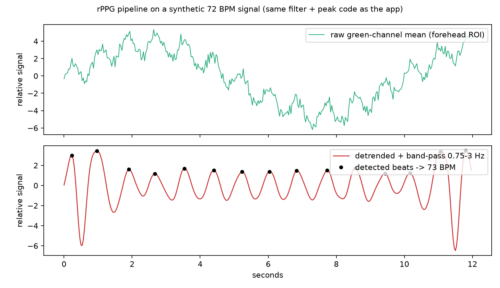

# Real-Time Face-Based Heart Rate Monitor (rPPG)

A contactless heart-rate monitor that reads your pulse from a standard webcam. Every heartbeat pushes blood through the skin of the forehead and changes its colour very slightly; the program measures that tiny green-channel flicker, filters it, and converts it to **beats per minute** in real time, drawing the live waveform beside the video. *Status: work in progress.*

> This repository documents the project (description, design, screenshots). The source code lives in a private repository, `Realtime_heart_rate_monitor-code`.

## Screenshot

The signal-processing stage, run with the project's own filter and peak-detection functions on a **synthetic** 72 BPM signal (a pulse buried in noise and slow lighting drift). The app needs a live webcam, so this figure shows the pipeline rather than a face on camera. The estimate came out at 72.6 BPM.



## How it works

```
webcam frame -> face landmarks -> forehead ROI -> mean green value per frame
   -> 12 s rolling buffer -> remove slow drift -> band-pass 0.75-3 Hz -> find peaks -> BPM
```

1. **Face landmarks**: MediaPipe Face Mesh locates the face; eight landmarks (indices 10, 338, 297, 332, 284, 251, 389, 356) outline a stable forehead region, drawn as a green box on the video.
2. **Signal**: the mean of the green channel inside that box is recorded for every frame (green absorbs the most light in haemoglobin, so it carries the clearest pulse), with timestamps, in a 12-second rolling buffer.
3. **Detrending**: a 1-second moving average is subtracted to remove lighting and movement drift.
4. **Band-pass filter**: a 4th-order Butterworth filter (zero-phase `filtfilt`) keeps 0.75 to 3.0 Hz, i.e. 45 to 180 BPM.
5. **Peaks to BPM**: heartbeat peaks are found with a minimum spacing of 0.4 s; `BPM = 60 / mean peak interval`. Values outside 30 to 220 are discarded and the last eight estimates are averaged to keep the display steady.
6. **Display**: an OpenCV window shows the video with a "Heart Rate: N BPM" overlay and a Matplotlib window plots the raw and filtered waveforms (about 4 updates per second). Press `q` to quit.

The first reading appears after about 2 seconds of data; accuracy improves as the buffer fills.

## Tips for good readings
Face the camera in steady, even light; stay still; avoid strong backlight and flickering lamps.

## Tech stack
Python, OpenCV, MediaPipe, NumPy, SciPy (Butterworth filter, peak finding), Matplotlib.

## Limitations
Not a medical device. Motion, lighting changes and skin tone affect accuracy.
